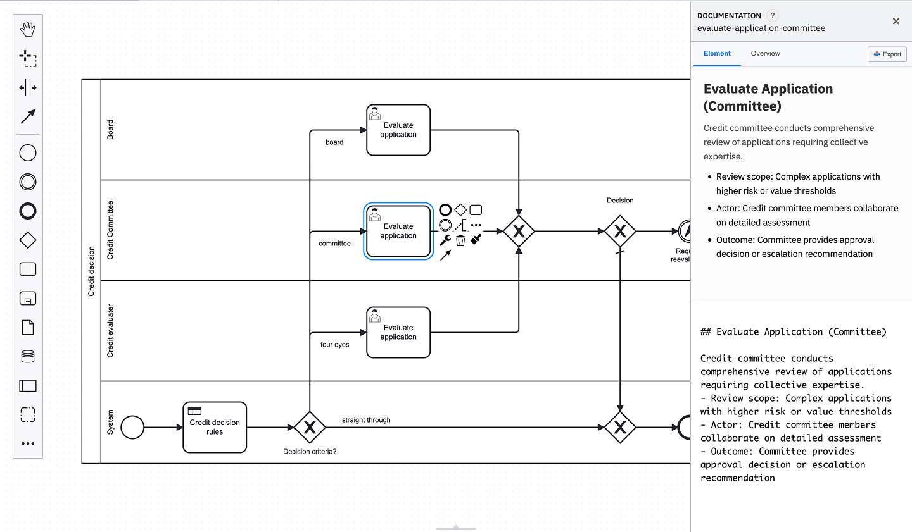
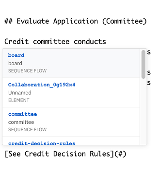
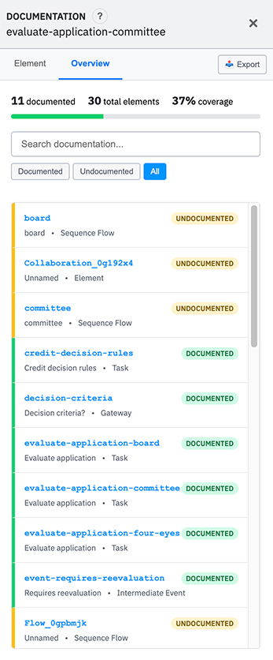

# BPMNJS Markdown Documentation Panel

 

A documentation extension for the [Camunda Modeler](https://camunda.com/platform/modeler/) and the [bpmn-js](https://bpmn.io/toolkit/bpmn-js/) package. It helps you write documentation for your processes, making it simpler for your users to understand how your processes work! It also feature read-only mode where the user is able to access your documentation.


_The documentation panel integrated with Camunda Modeler_

## Quick Start

### Camunda Modeler Plugin

1. **Download the latest release:**

   - Go to [Actions](https://github.com/Gawdfrey/bpmn-js-markdown-documentation-panel/actions/workflows/release.yml)
   - Download the release artifact

2. **Extract to your plugins directory:**

   **Windows:**

   ```
   %APPDATA%\camunda-modeler\plugins\
   ```

   **macOS:**

   ```
   ~/Library/Application Support/camunda-modeler/plugins/
   ```

   **Linux:**

   ```
   ~/.config/camunda-modeler/plugins/
   ```

3. **Restart Camunda Modeler** - The documentation panel will appear when you select BPMN elements

### bpmn-js

1. **Install the package:**

   ```bash
   npm install bpmn-js-markdown-documentation-panel
   ```

2. **Add to your bpmn-js setup:**

   ```javascript
   import BpmnModeler from "bpmn-js/lib/Modeler";
   import { DocumentationExtension } from "bpmn-js-markdown-documentation-panel";
   import "bpmn-js-markdown-documentation-panel/dist/style.css";

   const modeler = new BpmnModeler({
     container: "#canvas",
     additionalModules: [DocumentationExtension],
   });
   ```

## Features

### Markdown Documentation

- Add documentation to any BPMN element using markdown syntax
- Live preview of formatted content

### Element Linking

- Link between BPMN elements using `[Element Name](#ElementId)` syntax
- Autocomplete suggestions when typing `#` in links
- Click links to navigate to referenced elements
- Support for external URLs


_Autocomplete suggestions for element linking_

### Documentation Management

- Coverage tracking with progress indicators
- Element index with documentation status
- Search functionality across elements and content
- Filter by documentation status
- Export all documentation for a process to HTML


_Overview tab showing documentation coverage and element index_

## Usage Guide

### Adding Documentation

1. **Select any BPMN element** (task, gateway, event, etc.)
2. **Documentation panel appears** on the right side
3. **Write markdown** in the editor
4. **See live preview** above the editor

### Creating Element Links

1. **Use the syntax:** `[Link text](#ElementId)`
2. **Type `#` for autocomplete** - shows available elements
3. **Navigate with arrow keys** and press Enter to select
4. **Click links in preview** to jump to referenced elements

### Managing Documentation

1. **Switch to "Overview" tab** to see the big picture
2. **View coverage statistics** and progress tracking
3. **Search for elements** by ID, name, or content
4. **Filter by status** (documented, undocumented, all)
5. **Click any element** to jump to its documentation
6. **Click on "Export"** to export documentation and stats to HTML

## Development

### Setup

```bash
pnpm install           # Install dependencies
pnpm run dev          # Start development mode
pnpm run build        # Build for production
```

### Quality Checks

```bash
pnpm run lint         # ESLint
pnpm run type-check   # TypeScript
pnpm run knip         # Unused dependencies
pnpm run format       # Code formatting
```

### Testing

```bash
pnpm run test         # Run test suite
pnpm run test:watch   # Watch mode
```

## Release Management

This project uses [changesets](https://github.com/changesets/changesets) for version management:

```bash
pnpm changeset              # Create a changeset
pnpm changeset:version      # Version packages
pnpm changeset:publish      # Publish to npm
```

### Automated Releases

- GitHub Actions automatically creates release PRs
- Merging the release PR publishes to npm
- Preview releases are created for every PR via [pkg.pr.new](https://github.com/stackblitz-labs/pkg.pr.new)

## Contributing

1. Fork the repository
2. Create a feature branch
3. Make your changes
4. Run quality checks: `pnpm run lint && pnpm run type-check`
5. Submit a pull request
